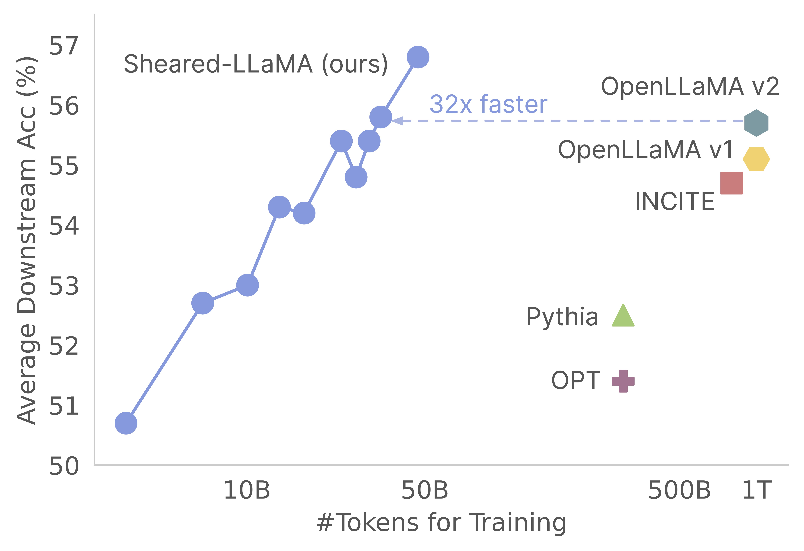

# 🦙 Sheared LLaMA: Accelerating Language Model Pre-training via Structured Pruning

🌟 [ArXiv Preprint](https://arxiv.org/abs/2310.06694) | [Blog Post](https://xiamengzhou.github.io/sheared-llama/)  

Base models: [Sheared-LLaMA-1.3B](https://huggingface.co/princeton-nlp/Sheared-LLaMA-1.3B) | [Sheared-LLaMA-2.7B](https://huggingface.co/princeton-nlp/Sheared-LLaMA-2.7B) | [Sheared-Pythia-160m](https://huggingface.co/princeton-nlp/Sheared-Pythia-160m/tree/main)  
Pruned Models without Continued Pre-training: [Sheared-LLaMA-1.3B-Pruned](https://huggingface.co/princeton-nlp/Sheared-LLaMA-1.3B-Pruned), [Sheared-LLaMA-2.7B-Pruned](https://huggingface.co/princeton-nlp/Sheared-LLaMA-2.7B-Pruned)  
Instruction-tuned models: [Sheared-LLaMA-1.3B-ShareGPT](https://huggingface.co/princeton-nlp/Sheared-LLaMA-1.3B-ShareGPT) | [Sheared-LLaMA-2.7B-ShareGPT](https://huggingface.co/princeton-nlp/Sheared-LLaMA-2.7B-ShareGPT)

Thank you for your interest in our work! This is a joint work by [Mengzhou Xia](https://xiamengzhou.github.io/), [Tianyu Gao](https://gaotianyu.xyz/about/), [Zhiyuan Zeng](https://zhiyuan-zeng.github.io/), and [Danqi Chen](https://www.cs.princeton.edu/~danqic/). Here, we provide our codebase for Sheared-LLaMA's pruning and continued pre-training algorithms :) We find that pruning strong base models is an extremely cost-effective way to get strong small-scale language models compared to pre-training them from scratch. The following graph shows that given the existence of Llama-2-7B model (pre-trained with 2T tokens), pruning it produces a model as strong as an OpenLLaMA model with 3% of its pre-training cost. 



**Update**
- [12/19/2023] Updated the [evaluation scripts](https://github.com/princeton-nlp/LLM-Shearing/blob/master/icl_eval) and pruning logs in the repo. 
- [11/22/2023] We released the instruction-tuned models [Sheared-LLaMA-1.3B-ShareGPT](https://huggingface.co/princeton-nlp/Sheared-LLaMA-1.3B-ShareGPT) and [Sheared-LLaMA-2.7B-ShareGPT](https://huggingface.co/princeton-nlp/Sheared-LLaMA-2.7B-ShareGPT).
- [11/19/2023] We released the [Sheared-Pythia-160m](https://huggingface.co/princeton-nlp/Sheared-Pythia-160m) model developed at early stages. It was produced using the same shearing recipe and the Pile dataset. 
- [11/05/2023] We released the code on LLM-Shearing - excited to see it being applied to more models of different scales.
- [10/10/2023] We released the Sheared-LLaMA paper, two Sheared LLaMA models and [tweeted about it](https://twitter.com/xiamengzhou/status/1712102912439226510) 🚀!

## 🔗 Quick Links
- [🦙 Sheared LLaMA: Accelerating Language Model Pre-training via Structured Pruning](#-sheared-llama-accelerating-language-model-pre-training-via-structured-pruning)
  - [🔗 Quick Links](#-quick-links)
  - [Brief Introduction](#brief-introduction)
  - [Install Requirements](#install-requirements)
  - [Data Preparation](#data-preparation)
  - [Model Preparation](#model-preparation)
  - [Sample Scripts for Pruning and Continued Pre-training](#sample-scripts-for-pruning-and-continued-pre-training)
  - [Convert Pruned Model](#convert-pruned-model)
  - [Convert Composer Model to Huggingface Model](#convert-composer-model-to-huggingface-model)
  - [Training Configurations](#training-configurations)
    - [Data configurations](#data-configurations)
    - [Basic training configurations](#basic-training-configurations)
    - [Pruning configurations](#pruning-configurations)
    - [Dynamic batch loading configurations](#dynamic-batch-loading-configurations)
  - [Throughput](#throughput)
  - [Future Work](#future-work)
  - [Bugs or Questions?](#bugs-or-questions)
  - [Citation](#citation)


##  Brief Introduction 
This codebase is built based on MosaicML's amazing [Composer package](https://github.com/mosaicml), which is specially designed and optimized for large language model pre-training. The entire implementation, including the `pruning` logic and the `dynamic batch loading` logic, are implemented as callback functions without touching the vanilla Composer trainer. Here's a concise overview of each folder within the codebase:
- `shearing.data`: Contains sample data and scripts for data processing. 
- `shearing.datasets`: Implements customized datasets to enable dynamic data loading.
- `shearing.callbacks`: Implements dynamic loading callbacks and pruning callbacks.
- `shearing.models`: Implements the model files.
- `shearing.scripts`: Contains scripts for running the code.
- `shearing.utils`: Includes all utility functions, such as model conversion and pruning tests.
- `train.py`: main entry of running the code


## Install Requirements
**Step 1**: To get started with this repository, you'll need to follow these installation steps. Before proceeding, make sure you have [Pytorch](https://pytorch.org/get-started/previous-versions/) and [Flash Attention](https://github.com/Dao-AILab/flash-attention)  installed. You can do this via pip using the following commands:
```
pip install torch==2.0.1+cu118 torchvision==0.15.2+cu118 torchaudio==2.0.2 --index-url https://download.pytorch.org/whl/cu118
pip install flash-attn==1.0.3.post
```
Please note that Flash Attention version 2 is not currently supported and may require manual modifications to the model file. 

**Step 2**: Then install the rest of the required packages:
```
cd llmshearing
pip install -r requirement.txt
```

**Step 3**: Finally, install the `llmshearing` package in editable mode to make it accessible for your development environment:
```
pip install -e .
```


## Data Preparation
Please refer to [llmshearing/data](llmshearing/data) for details on how to prepare data with Mosaicml's [Streaming](https://github.com/mosaicml/streaming) package. 

## Model Preparation
To utilize Hugging Face transformer models with Composer, you'll need to convert the model weights to the key format expected by Composer. Here's an example of how to convert the weights from the Hugging Face model 'llama2' into a compatible format for Composer:
```
# Define the Hugging Face model name and the output path
HF_MODEL_NAME=meta-llama/Llama-2-7b-hf
OUTPUT_PATH=models/Llama-2-7b-composer/state_dict.pt

# Create the necessary directory if it doesn't exist
mkdir -p $(dirname $OUTPUT_PATH)

# Convert the Hugging Face model to Composer key format
python3 -m llmshearing.utils.composer_to_hf $HF_MODEL_NAME $OUTPUT_PATH
```

Additionally, you can use the following utility function to test the equivalence between the Hugging Face model and the converted Composer model:
```
python3 -m llmshearing.utils.test_composer_hf_eq $HF_MODEL_NAME $OUTPUT_PATH
```

These functions exclusively work for LLaMA/LLaMA2 models. However, it should be straightforward to adapt them for use with other models such as Mistral-7B.


## Sample Scripts for Pruning and Continued Pre-training
For pruning, you can reference an example script located in [`llmshearing/scripts/pruning.sh`](https://github.com/princeton-nlp/LLM-Shearing/blob/master/llmshearing/scripts/pruning.sh).  In this script, you will need to make adjustments to incorporate [data configurations](), [basic training configurations](), [pruning configurations]() and [dynamic batch loading configurations](). 

Due to the relatively higher computational cost of pruning compared to continued pre-training, we halt training with the pruning objective after a specific number of steps (typically 3200 steps in all our experiments). Subsequently, we proceed with further pre-training of the pruned model. To ensure compatibility, it is necessary to convert the state dictionary keys of the model to align with a standard target model structure. Detailed instructions for this conversion can be found at [Convert Pruned Model](#convert-pruned-model).

After completing the model conversion, you can continue with the pre-training of the pruned model. The process is similar to pre-train a standard model. To do this, you can refer to an example script located at [`llmshearing/scripts/continue_pretraining.sh`]((https://github.com/princeton-nlp/LLM-Shearing/blob/master/llmshearing/scripts/continue_pretraining.sh)). In this script, the pruning configurations are eliminated.  

After training the model, you can use the conversion script to convert the composer model into a transformers model. Please refer to  [Section Convert Composer Model to Huggingface Model](#convert-composer-model-to-huggingface-model) for more details.

## Convert Pruned Model
Following the completion of training using [`llmshearing/scripts/pruning.sh`](https://github.com/princeton-nlp/LLM-Shearing/blob/master/llmshearing/scripts/pruning.sh), the saved models consist of the entire parameters of the source model, accompanied by a set of masks. We then act upon the masking variables by 1) removing the substructures where the masking variables are near $0$, 2) subsuming the masking variables into the model parameters by matrix-vector multiplcaition, and it result in a more compact model. Simultaneously, it becomes necessary to rename the weight keys so that they can be seamlessly loaded into a target model architecture, ensuring that the layer names are all consecutive. 

```
MODEL_PATH=$MODEL_DIR/latest-rank0.pt
python3 -m llmshearing.utils.post_pruning_processing prune_and_save_model $MODEL_PATH
```

The pruned model will be saved in `$(dirname $MODEL_PATH)/pruned-latest-rank0.pt`. 

## Convert Composer Model to Huggingface Model
After training, if you'd like to use use huggingface for inference or fine-tuning, you may opt to transform your composer model into a Hugging Face model using the [`llmshearing/scripts/composer_to_hf.py`](https://github.com/princeton-nlp/LLM-Shearing/blob/master/llmshearing/utils/composer_to_hf.py) script. Here's an example of how to use the script:

```
MODEL_PATH=$MODEL_DIR/latest-rank0.pt
OUTPUT_PATH=$MODEL_DIR/hf-latest_rank0
MODEL_CLASS=LlamaForCausalLM
HIDDEN_SIZE=2048
NUM_ATTENTION_HEADS=16
NUM_HIDDEN_LAYERS=24
INTERMEDIATE_SIZE=5504
MODEL_NAME=Sheared-Llama-1.3B

python3 -m llmshearing.utils.composer_to_hf $MODEL_PATH $OUTPUT_PATH \
        model_class=${MODEL_CLASS} \
        hidden_size=${HIDDEN_SIZE} \
        num_attention_heads=${NUM_ATTENTION_HEADS} \
        num_hidden_layers=${NUM_HIDDEN_LAYERS} \
        intermediate_size=${INTERMEDIATE_SIZE} \
        num_key_value_heads=${NUM_ATTENTION_HEADS} \
        _name_or_path=${MODEL_NAME}

```
Please be aware that the parameter names mentioned here are tailored to Llama2's Hugging Face configurations and may differ when dealing with other model types.

## Training Configurations
In this section, we provide an in-depth guide on configuring parameters within YAML configuration files for training. These configurations encompass several key aspects, including data setup, fundamental training settings, pruning settings, and dynamic data loading configurations.

### Data configurations
- `data_local`: The local directory containing the data. 
- `eval_loader.dataset.split`: For evaluation, provide the name of a combined split that includes data from all domains.
- `train_loader.dataset.split`: When `dynamic=True` (please refer to the [dynamic loading section](#dynamic)) in the dynamic loading configuration, there's no need to set this value. However, if `dynamic=False`, you must specify a training split. 

### Basic training configurations
The basic training configurations largely follow the original `Composer` package. For comprehensive details on these configurations, please refer to  [Composer's official documentation](https://docs.mosaicml.com/projects/composer/en/stable/). Here are some key training parameters to take note of:

- `max_duration`: This parameter defines the maximum training duration and can be specified in either the number of steps (e.g., `3200ba`) or epochs (e.g., `1ep`). In our experiments, the pruning duration was set to `3200ba`, and the continued pre-training duration was set to `48000ba`.
- `save_interval`: This parameter determines how frequently the model state is saved. We set it to `3200ba` for both the pruning and continued pre-training stages..
- `t_warmup`: This parameter specifies the duration of the learning rate warm-up for the learning rate scheduler. In the case of pruning, it is set to `320ba` ($10%$ of training), while for continued pre-training, it is set to 1440ba ($3%$ of training).
- `optimizer.lr`: This parameter defines the learning rate for the primary model parameters, with the default value being `1e-4`.
- `max_seq_len`: Following the Llama 2 training methodology, we accommodate a maximum sequence length of 4096.
- `device_train_microbatch_size`: This parameter determines the batch size per device during training. For the pruning stage, we configure it to `4`, whereas for continued pre-training, it is set to `16`.
- `global_train_batch_size`: This parameter specifies the global batch size across all GPUs during training. During the pruning stage, it is configured as `32`, while for continued pre-training, it is increased to `256`.
- `autoresume`: This parameter can be enabled by setting it to `true` when resuming a run. However, it's important to note that while we have used it successfully during the continued pretraining stage, there is no guarantee of its compatibility with the pruning stage.

Due to computational constraints, an exhaustive hyperparameter search was not conducted, and there may exist better hyper-parameters for improved performance.


### Pruning configurations
The pruning process allows pruning a source model to a specific target shape, and the script includes essential parameters such as:

- `from_model`: This parameter specifies the source model size and corresponds to a config_file.  
- `to_model`: This parameter defines the target model size, and the source model will be pruned to match the target configuration.  
- `optimizer.lag_lr`: This parameter specifies the learning rate to learn the masking variables and Lagrangian multipliers during pruning. The default value is $1.0$. 

The pruning-specific arguments are all grouped under `model.l0_module`:  

- `model.l0_module.lagrangian_warmup_steps`: 
In the initial warm-up phase, the pruning rate incrementally rises from 0 to reach the desired target value. The specific target value is determined by the predefined structure of the target model. It's important to note that this value might differ from the warm-up steps associated with learning rates. Typically, we allocate approximately 20% of the total number of steps for this pruning warm-up process.   
- `model.l0_module.pruning_modules`: By default, this setting prunes various aspects of the model, including the head, intermediate dimensions, hidden dimensions, and layers.  
- `model.l0_module.eval_target_model`: When set to true, the evaluation process assesses a submodel that exactly matches the target model's structure. If set to false, the evaluation process considers the current model, taking into account the masking values. Since the mask may take some time to converge to the target model shape, we evaluate based on the current model shape rather than the target structure during training.  
- `model.l0_module.target_model.d_model`: Specifies the hidden dimension of the target model.  
- `model.l0_module.target_model.n_heads`: Specifies the number of heads in the target model.  
- `model.l0_module.target_model.n_layers`: Specifies the number of layers in the target model.  
- `model.l0_module.target_model.intermediate_size`: Specifies the number of intermediate dimensions in the target model.

These parameters allow you to configure and control the pruning process according to your specific requirements.

### Dynamic batch loading configurations
We extend [Steaming's StreamingDataset](https://github.com/mosaicml/streaming/blob/a94476b2f2d29f929a6963d774fd1a8d68efbab2/streaming/base/dataset.py#L170) in [datasets/streaming_dataset.py](datasets/streaming_dataset.py) to support loading data dynamically. The parameters for configuring dynamic batch loading are primarily defined within the `DynamicLoadingCallback`. Most of the following configurations can be specified in a YAML configuration file under the `callbacks.data_loading` section. Here's an explanation of each parameter:

- `callbacks.data_loading.dynamic`: This boolean parameter determines whether dynamic data loading is enabled. When set to true, data is loaded dynamically from various domains or streams. If set to false, dynamic data loading is disabled.
- `callbacks.data_loading.set_names`: Specify the domain names or stream names that will be used for dynamic data loading.
- `callbacks.data_loading.proportion`: This parameter defines the initial data loading proportion for each domain or stream. The sum of all proportions must equal 1, indicating the relative weights of each source in the initial data loading configuration.
- `callbacks.data_loading.update_type`: Choose the update type for adjusting the data loading proportions during training. There are two options
    - `doremi`: In this mode, the data loading proportions are updated using an exponential descent approach, similar to the method described in [Doremi](https://arxiv.org/abs/2305.10429). This allows for adaptive adjustment of data loading proportions over time.
    - `constant`: Selecting this option keeps the data loading proportions constant throughout training. It's equivalent to disabling dynamic data loading.
- `callbacks.data_loading.target_loss`: Specify the target validation loss for the training process. This target loss value should be calculated or predetermined before training begins. The loading proportions will be dynamically adjusted based on the difference between the model's current loss and the target loss. This adjustment helps guide the training process towards the desired performance level. 
- `eval_interval`: Determine how often evaluations are performed during training. If `dynamic=True`, the data loading proportion will be adjusted after each evaluation.

The code is designed to exclusively accommodate local data and does not support remote streaming data. Additionally, it currently only functions with a single worker for the dataloader and does not offer prefetch support. In our testing, this restriction has does not incur any additional compute overhead.

## Throughput
Here is the throughout of running the pruning and continued pretraining step with A100 80GB GPUs. The throughput is quantified in terms of tokens processed per second. Please refer to the standard throughput of [llm-foundry](https://github.com/mosaicml/llm-foundry/blob/dd15791818fa53ae792de66d3529d94e0dcb83d9/scripts/train/benchmarking/README.md#a100-80gb-with-1600-gbps-node-node-interconnect-roce).

|           | GPUs           | Throughput per Device | Throughput   |
|-----------|----------------|------------------------|--------------|
| Pruning 7B| 8              | 1844                   | 14750        |
| Pre-training 3B | 16       | 4957                   | 79306        |
| Pre-training 1.3B | 16     | 8684                   | 138945       |


## Future Work

**Source models**: While large models are undoubtedly powerful and have the potential to become stronger in the near future, we believe that small-scale models (those with fewer than 7 billion parameters) have untapped potential. However, there is little effort dedicated to making small models stronger, and our work pushes towards this goal. A natural extension of this work is to extend the codebase to prune
- Stronger base models, such as [Mistral-7B](https://mistral.ai/news/announcing-mistral-7b/)
- Domain-specific language models such as code base models, including [CodeLlama](https://huggingface.co/codellama), and [DeepSeek-Coder](https://huggingface.co/codellama)
- Models from different scales. We mainly worked with 7B models due to computational constraints. It's unclear if pruning from larger models will be more beneficial.

To adapt the codebase to other models, one key component is to make sure that running the model with masks is equivalent to running the pruned model. We use [llmshearing/utils/test_pruning.py](llmshearing/utils/test_pruning.py) to run such tests to ensure the correctness of the function `prune_params` in model files. 

**Data Sources**: Please keep in mind that the performance of the resulting model is contingent not only on the pruning algorithm and the base model but also on the quality of the data. In our experiments, we mainly worked the [RedPajama v1 data](https://huggingface.co/datasets/togethercomputer/RedPajama-Data-1T). However, here are some additional resources that could be considered for inclusion:

- [Dolma data](https://huggingface.co/datasets/allenai/dolma), a 3T pre-training dataset including domains of CommonCrawl, C4, peS2o, The Stack, Project Gutenberg and Wikipedia
- [proof-pile-2](https://huggingface.co/datasets/EleutherAI/proof-pile-2), a 55 billion token dataset of mathematical and scientific documents.
- [RedPajama-v2](https://together.ai/blog/redpajama-data-v2), a 30T token pre-training dataset.


## Bugs or Questions?
If you have any questions related to the code or the paper, feel free to email Mengzhou (mengzhou@princeton.edu). If you encounter any problems when using the code, or want to report a bug, you can open an issue. Please try to specify the problem with details so we can help you better and quicker!


## Citation
Please cite our paper if you find the repo helpful in your work:

```bibtex
@article{xia2023sheared,
  title={Sheared llama: Accelerating language model pre-training via structured pruning},
  author={Xia, Mengzhou and Gao, Tianyu and Zeng, Zhiyuan and Chen, Danqi},
  journal={arXiv preprint arXiv:2310.06694},
  year={2023}
}
```


